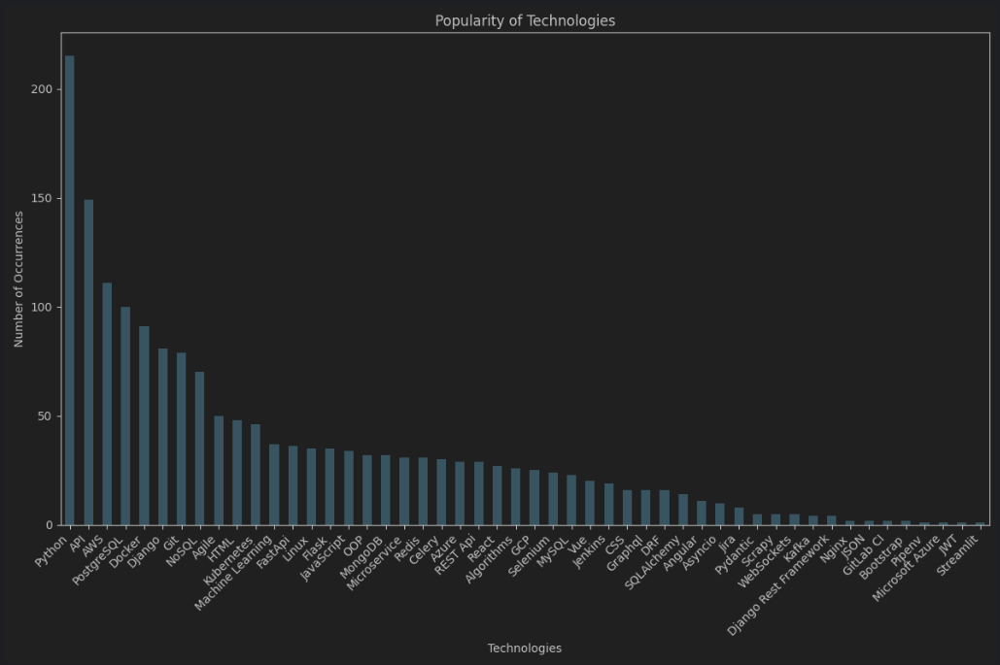
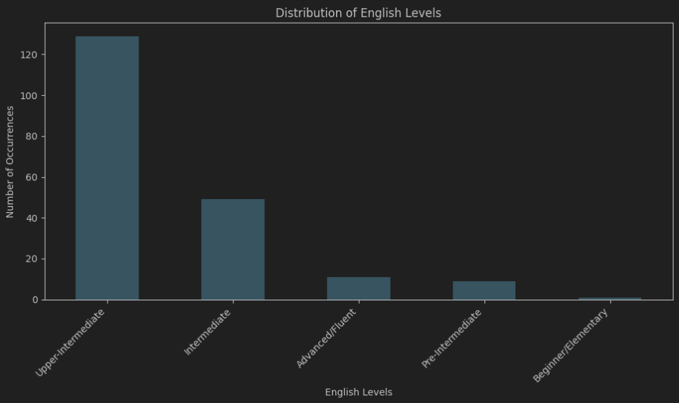

# Djinni vacancies scraping

## Overview
The Python Vacancies project provides a comprehensive solution for tracking the 
latest trends in Python-related job postings. By utilizing web scraping techniques 
and data analysis, the project offers valuable insights into the most in-demand 
technologies within the job market. The main aim is to help people looking for 
jobs and those working in Python development by showcasing the important skills 
and technologies that employers are looking for.

## Features
- **Web Scraping Capabilities**: The project employs web scraping to extract relevant 
data from job vacancy listings on platforms such as Djinni. 
- **Data Analysis**: Through data analysis, the project identifies and categorizes the
technologies mentioned in job descriptions, providing a clear overview of the skills 
and tools currently in demand. 
- **Insights into Job Trends**: By monitoring and analyzing job postings, the project 
helps users stay informed about emerging trends, enabling them to make well-informed 
decisions regarding their skill development and career paths. 
- **User-Friendly Visualization**: The project presents its findings through 
user-friendly visualizations, making it easy for users to interpret and understand 
the trends in the job market.

## Getting Started
1. **Clone the Repository**:

```bash
git clone https://github.com/RabenkoYevhenii/web_scraping.git
```
2. **Navigate to the Project Directory**:

```bash
cd djinni_vacancy_scraping
```
3. **Create a Virtual Environment**:

```bash
python -m venv venv
```
4. **Activate the Virtual Environment**:
* On Linux/Mac:
```bash
source venv/bin/activate
```
* On Windows:
```bash
venv\Scripts\activate
```
5. **Install Dependencies**:

```bash
pip install -r requirements.txt
```
6. **Run the Web Scraping Script**:

```bash
scrapy crawl vacancies -O vacancies.csv
```
7. **Go to visualisation.ipynb**

8. **Click button "Run all" (Ctrl + Alt + Shift + Enter)**

## Sample Results

